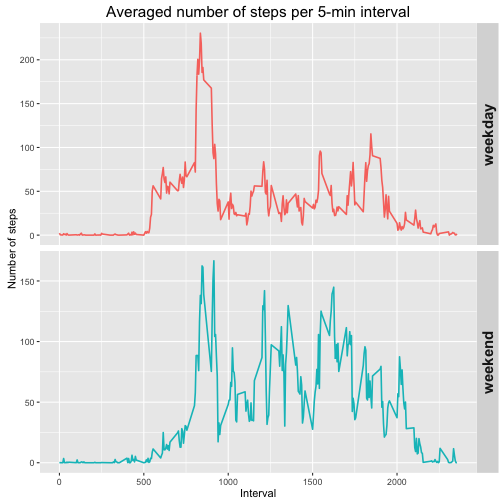

## Loading and preprocessing the data

```r
library(ggplot2)
library(dplyr)
datafile <- "activity.csv"
df <- read.csv(datafile)
df$date <- as.Date(df$date)
```


## What is mean total number of steps taken per day?
1. Calculate the total number of steps taken per day:

```r
groupday <- group_by(df, date)
stepstotday <- summarise(groupday, steps = sum(steps, na.rm = TRUE))
#stepstotday <- tapply(df$steps, df$date, sum, na.rm = TRUE)
```
2. Histogram of the total number of steps taken each day

```r
qplot(steps, data = stepstotday)+ 
    labs(title = "Total number of steps per day", y = "Number of days", 
        x ="Total number of steps")
```

```
## stat_bin: binwidth defaulted to range/30. Use 'binwidth = x' to adjust this.
```

 

3. Mean and median of the total number of steps taken per day:

```r
meansteps <- mean(stepstotday$steps, na.rm = TRUE)
mediansteps <- median(stepstotday$steps, na.rm = TRUE)
```
The mean of the total number of steps per day is 9354.2295082 and the median is 10395.

## What is the average daily activity pattern?
1. Average number of steps of each 5-minutes interval averaged across all days:

```r
stepsinterv <- tapply(df$steps, df$interval, mean, na.rm = TRUE)
interval <- unique(df$interval)
plot(interval, stepsinterv, type = "l", main = "Averaged number steps", ylab = "Number steps", xlab = "Interval")
```

 


2. The 5-minutes interval with the maximum number of steps, averged across all the days:

```r
maxstepinterv <- max(stepsinterv)
ma <- which(stepsinterv == maxstepinterv)
maxstep <- interval[ma[1]]
```
That interval is 835.

## Imputing missing values
1. Total number of missing values:

```r
natot <- sum(is.na(df$steps))
```
The total number of missing values in the dataset is 2304.


2. & 3. Filling in all of the missing values in the dataset and store them in a new dataset (missing data filled in):

```r
newdf <- df
naa <- which(is.na(df$steps))
# Filling the NA values with the mean for that 5-minute interval (stepsinterv)
for (i in 1:length(naa)){
    temint <- df$interval[naa[i]]
    ind <- which(interval == temint)
    newdf$steps[naa[i]] <- stepsinterv[ind]
}
sum(is.na(newdf$steps))
```

```
## [1] 0
```

```r
head(newdf)
```

```
##       steps       date interval
## 1 1.7169811 2012-10-01        0
## 2 0.3396226 2012-10-01        5
## 3 0.1320755 2012-10-01       10
## 4 0.1509434 2012-10-01       15
## 5 0.0754717 2012-10-01       20
## 6 2.0943396 2012-10-01       25
```

4. Histogram of the total number of steps for each day:

```r
nstepstotday <- tapply(newdf$steps, newdf$date, sum, na.rm = TRUE)
hist(nstepstotday, main = "Total number of steps per day", xlab = "Total number of steps", ylab = "Number of days")
```

 

```r
newmean <- mean(nstepstotday, na.rm = TRUE)
newmedian <- median(nstepstotday, na.rm = TRUE)
```

The mean of the total number of steps taken per day is 1.0766189 &times; 10<sup>4</sup> and the median is 1.0766189 &times; 10<sup>4</sup>.


## Are there differences in activity patterns between weekdays and weekends?

1. New factor variable in the dataset with two levels, *weekday* and *weekend*, indicating whether a given date is a weekday or weekend day.

```r
week <- weekdays(newdf$date)
weekend <- which(week == "Saturday" | week == "Sunday")
week[weekend] <- "weekend"
week[-weekend] <- "weekday"
# Adding the factor variable:
newdf$daytype <- as.factor(week)
str(newdf)
```

```
## 'data.frame':	17568 obs. of  4 variables:
##  $ steps   : num  1.717 0.3396 0.1321 0.1509 0.0755 ...
##  $ date    : Date, format: "2012-10-01" "2012-10-01" ...
##  $ interval: int  0 5 10 15 20 25 30 35 40 45 ...
##  $ daytype : Factor w/ 2 levels "weekday","weekend": 1 1 1 1 1 1 1 1 1 1 ...
```

2. Time series plot of the 5-minute interval and the average number of steps taken, averaged across all weekday days or weekend days:

```r
library(ggplot2)

te <- newdf %>% group_by(daytype, interval)
ff <- te %>% summarise_each(funs(mean(., na.rm=TRUE)))

ggplot(ff, aes(interval, steps)) + 
              facet_grid(daytype ~., scales = "free_y") +
              geom_line(aes(color = daytype), size = 0.75) +
              labs(title = "Averaged number of steps for the weekdays and weekends", 
                   y = "Number of steps", x ="Interval") +
              theme(plot.title = element_text(size = rel(1.4))) + 
              theme(legend.position = "none") + 
              theme(strip.text.y = element_text(size = 15, angle = 90, face = "bold"))
```

 

```r
# library(lattice)              
# xyplot(steps ~ interval | daytype, data = ff, type="l")
```

    
