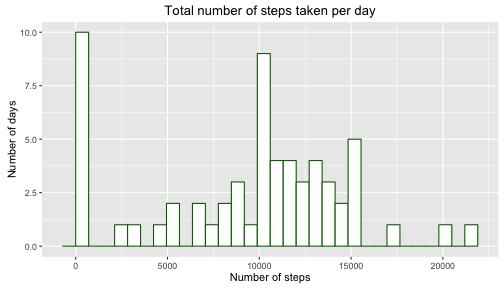
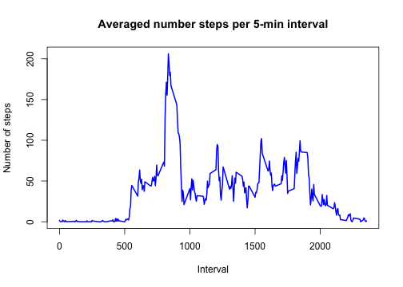
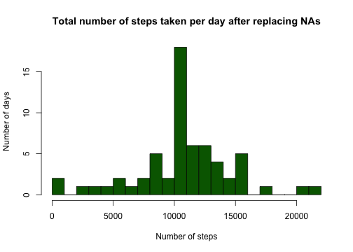

```r
# Libraries:
library(knitr)
library(ggplot2)
library(dplyr)
# To process the Rmd file from console:
#knit2html("PA1_template.Rmd")
#browseURL("PA1_template.html")
```

## Loading and preprocessing the data

```r
datafile <- "activity.csv"
if (file.exists(datafile) != TRUE) {unzip("activity.zip")}
df <- read.csv(datafile)
df$date <- as.Date(df$date, format = "%Y-%m-%d")
```


## What is mean total number of steps taken per day?
1. Calculate the total number of steps taken per day (ignoring the missing values):

```r
# Grouped according to date:
groupday <- group_by(df, date)
stepstotday <- summarise(groupday, steps = sum(steps, na.rm = TRUE))
```

2. Histogram of the total number of steps taken each day:

```r
qplot(steps, data = stepstotday, bins = 30) + 
    labs(title = "Total number of steps taken per day", y = "Number of days", 
        x ="Number of steps") +  
    geom_histogram(colour = "darkgreen", fill = "white", bins = 30) 
```

 

3. Mean and median of the total number of steps taken per day:

```r
meansteps <- mean(stepstotday$steps)
mediansteps <- median(stepstotday$steps)
```
The **mean** of the total number of steps taken per day is **9354.23** steps and the **median** is **10395** steps.

These two quantites are calculated ignoring the missing values (NAs) when applying the *sum* command (*na.rm = TRUE*). However, if all measuraments taken during one specific day were NAs, the total number of steps given by this procedure is then 0. This is the case for 8 of the 61 tracked days. 


## What is the average daily activity pattern?
1. Average number of steps of each 5-minutes interval averaged across all days:

```r
stepsinterv <- tapply(df$steps, df$interval, mean, na.rm = TRUE)
interval <- unique(df$interval)
plot(interval, stepsinterv, type = "l", main = "Averaged number steps per 5-min interval", ylab = "Number of steps", xlab = "Interval", col = "blue", lwd = 2 )
```

 

There is a clear increase of number of steps between the 750 and 1000 time interval with respect the rest of the day. 


2. The 5-minutes interval with the maximum number of steps, averged across all the days:

```r
ma <- which.max(stepsinterv)
maxstep <- interval[ma[1]]
```
The 5-min interval with the maximum number of steps is **835**.


## Imputing missing values
1. Total number of missing values:

```r
NAtot <- sum(is.na(df$steps))
```
The total number of missing values in the dataset is **2304**.

2. Devise a strategy for filling in all of the missing values in the dataset:

The missing values in a 5-min interval are filled in with the mean for that 5-minute interval calculated in the previous section. 

3. Filling in all of the missing values in the dataset and store them in a new dataset (missing data filled in):

```r
# Create a DF as the original one:
newdf <- df
# Localise the index where there are missing values (NA):
naa <- which(is.na(df$steps))
# Fill the NA values with the mean for that 5-minute interval (stepsinterv):
for (i in 1:length(naa)){
    temint <- df$interval[naa[i]]
    ind <- which(interval == temint)
    newdf$steps[naa[i]] <- stepsinterv[ind]
}
# head(newdf)  
```
*Checking that the procedure has worked*: The number of missing values (NAs) in the new dataframe is: 0.

4. Histogram of the total number of steps for each day after filling in the missing values:

```r
nstepstotday <- tapply(newdf$steps, newdf$date, sum, na.rm = TRUE)
hist(nstepstotday, main = "Total number of steps taken per day after replacing NAs", xlab = "Number of steps", ylab = "Number of days", breaks = 30, col = "darkgreen")
```

 

```r
newmean <- mean(nstepstotday)
newmedian <- median(nstepstotday)
```

The mean of the total number of steps taken per day is **10766.19** and the median is **10766.19**, which are slightly larger than those obtained when the missing data were removed (specially for the mean parameter, which differs around a 14%). 

Therefore, the presence of missing values can add some bias (even if small) into the calculations of certain parameters, such as the mean and median of the total number of steps per day. The impact of imputing missing data is not really big in this case, but this procedure needs to be thoroughly studied for each specific dataset analysed.


## Are there differences in activity patterns between weekdays and weekends?

1. New factor variable in the dataset with two levels, *weekday* and *weekend*, indicating whether a given date is a weekday or weekend day:

```r
week <- weekdays(newdf$date)
weekend <- which(week == "Saturday" | week == "Sunday")
week[weekend] <- "weekend"
week[-weekend] <- "weekday"
# Adding the factor variable:
newdf$daytype <- as.factor(week)
# Checking the procedure worked:
str(newdf)
```

```
## 'data.frame':	17568 obs. of  4 variables:
##  $ steps   : num  1.717 0.3396 0.1321 0.1509 0.0755 ...
##  $ date    : Date, format: "2012-10-01" "2012-10-01" ...
##  $ interval: int  0 5 10 15 20 25 30 35 40 45 ...
##  $ daytype : Factor w/ 2 levels "weekday","weekend": 1 1 1 1 1 1 1 1 1 1 ...
```

2. Time series plot of the 5-minute interval and the average number of steps taken, averaged across all weekday days or weekend days:

```r
# Grouping the updated dataframe into the type of day (weekday or weekend0, and interval:
tem <- newdf %>% group_by(daytype, interval)
# Calculating the mean for each of those groups:
ff <- tem %>% summarise_each(funs(mean(., na.rm = TRUE)))

ggplot(ff, aes(interval, steps)) + 
              facet_grid(daytype ~., scales = "free_y") +
              geom_line(aes(color = daytype), size = 0.75) +
              labs(title = "Averaged number of steps per 5-min interval", 
                   y = "Number of steps", x ="Interval") +
              theme(plot.title = element_text(size = rel(1.4))) + 
              theme(legend.position = "none") + 
              theme(strip.text.y = element_text(size = 15, angle = 90, face = "bold"))
```

 

This plot illustrates that earlier in the morning (time interval between 750 and 1000), the averaged of steps is *lower* during the weekends than during the weekdays. Later in the day (time interval from 1000), the number of steps is *similar* both during the weekends and weekdays, being slightly larger during the weekends. 
  
